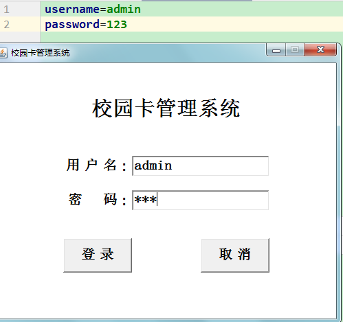

<h1 align="center">校园卡管理系统</h1>

## 简介
校园卡管理系统：角色分为管理员和普通用户；用户登录、余额查询、充值消费、挂失管理，管理员能够进行用户管理、卡片操作、充值记录和消费记录查询等功能，方便校园卡使用和管理。    --计算机毕业设计源码；毕设源码；java毕业设计源码

## 联系方式

<h3 align="center">获取完整代码与数据库文件 + 微信：deepguan QQ: 86050149 QQ群: 783742310</h3>

<h3 align="center">可帮忙远程部署 包运行成功！提供远程部署、修改代码、设计文档指导、代码讲解等服务！</h3>

## 功能介绍（完整见运行截图）
管理员：登录校园卡管理系统后，管理员可以管理校园卡用户的信息和账户。功能包括查看和修改用户信息，管理账户余额，处理挂失和注销请求，执行充值和消费操作，以及查看充值和消费记录。管理员还需确保数据完整以便系统正常运行。

用户：用户通过校园卡管理系统可以进行账户登录，查看个人信息，查询余额，进行账户充值，并查看详细的消费记录。用户可以自行修改密码，确保账户安全。同时，用户需确保账户有足够余额以正常使用校园卡功能。

## 运行截图

本代码来源于网络,仅供学习参考使用!

